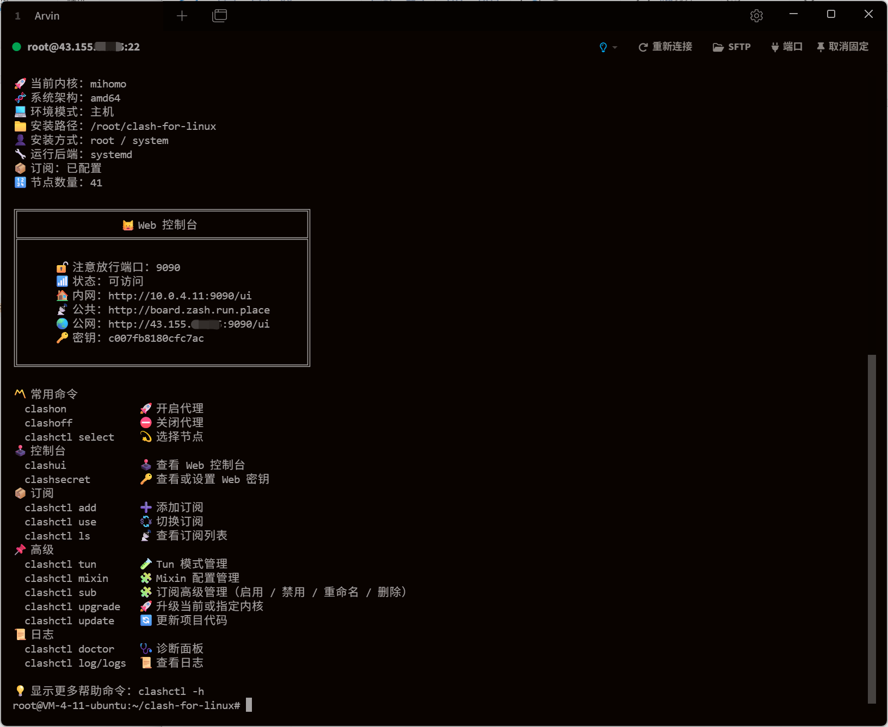

<h1 align="center">
  🐱 Clash for Linux</a>
  <br>
</h1>


<h3 align="center">
一个更完整、更优雅的 Linux Clash / <a href="https://github.com/MetaCubeX/mihomo">Mihomo</a> 运行平台。
</h3>
<p align="center">
  
</p>


# ✨ 核心特性

- 🚀 **自动识别系统架构**：自动下载并使用对应 Clash 内核
- 🧪 **端口自动检测与分配**：避免冲突
- 🔄 **多订阅管理**：可以保存多个订阅，通过 `clashctl use` 切换当前主订阅。
- 💫 **节点选择**：使用编号交互选择策略组和节点。
- 🌐 **Tun 模式**：用于透明代理接管场景。
- 🧠 **Mixin 机制**：可按需追加/覆盖 Clash 配置
- 👤 **不同权限**：兼容 `root` 与普通用户环境。
- 🔐 **安全默认配置**：自动生成或自定义 Secret
- 🩺 **内置诊断工具（`doctor`）**：快速排障 

### 适用场景

- Linux 云服务器（VPS）
- 家用 NAS / 小主机（x86 / ARM）
- 需要稳定访问 GitHub、Go / Node / Docker 生态的开发环境
- 不希望长期手动维护 Clash 运行状态的用户

# 🚀 一键安装（推荐）

在终端中执行以下命令即可完成安装：

```
git clone --branch master --depth 1 https://ghfast.top/https://github.com/wnlen/clash-for-linux.git
cd clash-for-linux
bash install.sh
```

- 上述命令使用了[加速前缀](https://gh-proxy.org/)，如失效可更换其他[可用链接](https://ghproxy.link/)。
- 可通过 `.env` 文件或脚本参数自定义安装选项。

### OpenWrt 脚本模式

当前提供 OpenWrt 脚本模式兼容，适合 x86_64/amd64 与 aarch64/arm64 软路由或设备。该模式复用现有 `script` 运行后端，不包含 procd 开机自启、LuCI、UCI 或 opkg 包化支持，也不承诺 MIPS 与 armv7 设备可用。

建议先将项目放到持久化目录，避免放在 `/tmp`、`/run` 等重启会丢失的位置：

```bash
cd /root
git clone --branch master --depth 1 https://ghfast.top/https://github.com/wnlen/clash-for-linux.git
cd clash-for-linux
```

安装依赖：

```bash
opkg update
opkg install bash curl tar gzip coreutils-readlink unzip
```

安装与手动管理：

```bash
bash install.sh
clashon
clashctl status
clashoff
```

OpenWrt 下 root/system 安装会把 `clashctl`、`clashon`、`clashoff` 等命令入口写入 `/usr/bin`，运行状态、日志和内核二进制仍保存在项目目录的 `runtime/` 下。仅脚本模式不会注册开机自启，设备重启后需要重新执行 `clashon`。

------

## ⌨️ 命令一览

```bash
〽️ 常用命令
  clashon            🚀 开启代理
  clashoff           ⛔ 关闭代理
  clashctl select    💫 选择节点
🕹️  控制台
  clashui            🕹️  查看 Web 控制台
  clashsecret        🔑 查看或设置 Web 密钥
📦 订阅
  clashctl add       ➕ 添加订阅
  clashctl use       💱 切换订阅
  clashctl ls        📡 查看订阅列表
📌 高级
  clashctl tun       🧪 Tun 模式管理
  clashctl mixin     🧩 Mixin 配置管理
  clashctl relay     🔗 多跳节点管理
  clashctl sub       🧩 订阅高级管理（启用 / 禁用 / 重命名 / 删除）
  clashctl upgrade   🚀 升级当前或指定内核
  clashctl update    🔄 更新项目代码
📜 日志
  clashctl doctor    🩺 诊断面板
  clashctl log/logs  📜 查看日志

💡 显示更多帮助命令：clashctl -h
💡 更多高级能力：clashctl help advanced
```

------

## 🌐 Web 控制台

```bash
$ clashui
╔═══════════════════════════════════════════════╗
║                🐱 Web 控制台                  ║
║═══════════════════════════════════════════════║
║                                               ║
║     🔓 注意放行端口：9090                      ║
║     📶 状态：可访问                            ║
║     🏠 内网：http://192.168.0.1:9090/ui       ║
║     ☁️ 公共：http://board.zash.run.place      ║
║     🌏 公网：http://8.8.8.8:9090/ui           ║
║     🔑 密钥：dada289edb457b59                 ║
║                                               ║
╚═══════════════════════════════════════════════╝

$ clashsecret mysecret
🐱 密钥更新成功，已重启生效

$ clashsecret
🐱 当前密钥：mysecret
```

- 可通过浏览器打开 `Web` 控制台进行可视化操作，例如切换节点、查看日志等。
- `clashctl secret` 作为兼容入口继续保留，日常优先使用 `clashsecret`。
- 默认使用 [zashboard](https://github.com/Zephyruso/zashboard) 作为控制台前端，如需更换可自行配置。
- 若需将控制台暴露到公网，建议定期更换访问密钥，或通过 `SSH` 端口转发方式进行安全访问。


------

## 🧰 常用管理命令

### 多订阅管理

```
clashctl add <订阅链接> <名称>
clashctl use
clashctl ls
clashctl sub
clashctl sub list
clashctl sub enable <名称>
clashctl sub disable <名称>
clashctl sub rename <旧名称> <新名称>
clashctl sub remove <名称>
```

------

## 🏗️ 架构设计架构简述

项目当前可以按三层理解：

### Control

用户入口层。

- `clashctl`
- `clashon`
- `clashoff`
- `status`
- `doctor`
- `ui`
- `select`

Control 层负责把常用动作收口成可理解的命令和反馈。

### Build

配置生成层。

- 多订阅保存
- 单 active 主订阅
- active-only 编译链
- 订阅下载 / 转换 / 校验
- `config/mixin.yaml` 运行补丁
- 输出 `runtime/config.yaml`

当前规则很明确：`generate_config` 只处理当前 active 主订阅。

### Runtime

实际运行层。

- `runtime/` 是唯一运行时容器
- 后端可以是 `systemd`、`systemd-user` 或 `script`
- 运行配置是 `runtime/config.yaml`
- 订阅集合状态是 `runtime/subscriptions.yaml`（历史 `config/subscriptions.yaml` 仅用于兼容迁移）
- 日志、状态、缓存和运行时产物都收敛到 runtime 体系

## 配置说明

### `.env`

`.env` 用于覆盖安装和运行参数。常用项包括：

```bash
KERNEL_TYPE=mihomo
MIXED_PORT=7890
EXTERNAL_CONTROLLER=0.0.0.0:9090
CLASH_CONTROLLER_SECRET=your-secret
CLASH_SUBSCRIPTION_URL=https://example.com/sub
MIHOMO_VERSION=latest
CLASH_VERSION=latest
YQ_VERSION=v4.44.3
SUBCONVERTER_VERSION=v0.9.0
MIHOMO_DOWNLOAD_BASE=https://github.com/MetaCubeX/mihomo/releases/download
CLASH_DOWNLOAD_BASE=https://github.com/WindSpiritSR/clash/releases/download
```

按需设置即可，不需要每项都写。

### `config/mixin.yaml`

用于对最终运行配置做补丁：

- `override` 覆盖字段
- `prepend` 把数组项放到原始配置前面
- `append` 把数组项放到原始配置后面

查看当前模板：

```bash
clashctl mixin
```

编辑：

```bash
clashctl mixin edit
```

查看最终运行配置：

```bash
clashctl mixin runtime
```

### 

------

## 🔄 更新

```bash
clashctl update
clashctl upgrade
clashctl upgrade mihomo
clashctl upgrade clash
```

`update` 用于更新项目代码与运行依赖。`upgrade` 用于升级当前或指定代理内核。

------

## 🧩 Mixin 配置

```bash
clashctl mixin
clashctl mixin edit
clashctl mixin raw
clashctl mixin runtime
```

Mixin 是运行配置补丁，不是订阅管理。它通过 `config/mixin.yaml` 对当前 active 订阅生成的运行配置执行：

- `override`
- `prepend`
- `append`

示例：

```yaml
override:
  dns:
    enable: true

prepend:
  proxies: []
  proxy-groups: []
  rules:
    - DOMAIN-SUFFIX,example.com,DIRECT

append:
  proxies: []
  proxy-groups: []
  rules:
    - MATCH,节点选择
```

编辑后执行：

```bash
clashctl mixin edit
```

它会重新生成配置；如果代理正在运行，会自动重启应用。

### 多跳节点

多跳节点会写入 `config/mixin.yaml`，通过 Mihomo/Clash 的 `relay` 策略组串联已有订阅节点。节点名称必须与订阅生成的节点名完全一致，可先通过 Web 控制台确认：

```bash
clashon
clashui
```

按域名小范围测试：

```bash
clashctl relay add 多跳-示例 节点A 节点B --domain example.com
clashctl relay list
```

也可以使用快捷入口：`clashrelay list`。

全局接管：

```bash
clashctl relay add 全局多跳 节点A 节点B --match
```

`--match` 会让所有未提前命中的流量走多跳，建议先用 `--domain` 验证链路。删除多跳配置：

```bash
clashctl relay remove 多跳-示例
```

------

## 🌐 Tun 模式

```bash
clashctl tun on
clashctl tun off
clashctl tun doctor
clashctl tun logs
```

Tun 用于透明接管链路。`tun on` 是动作反馈，展示当前关键配置和简短状态；完整证据请看：

```bash
clashctl tun doctor
```

Tun 判断不会简单把 `root` 等同于拥有 `CAP_NET_ADMIN`，也不会把 main table 默认路由未切换直接等同于 Tun 未生效。诊断会结合运行后端、容器环境、进程能力、Tun adapter、policy routing、路由表和日志证据。

------

## 🧹 卸载

```
bash uninstall.sh
```

## 设置代理
1. 开启 IP 转发

```bash
echo "net.ipv4.ip_forward = 1" | tee -a /etc/sysctl.conf
sysctl -p
```

2.配置iptables
```bash
# 先清空旧规则
iptables -t nat -F

# 允许本机访问代理端口
iptables -t nat -A OUTPUT -p tcp --dport 7890 -j RETURN
iptables -t nat -A OUTPUT -p tcp --dport 7891 -j RETURN
iptables -t nat -A OUTPUT -p tcp --dport 7892 -j RETURN

# 让所有 TCP 流量通过 7892 代理
iptables -t nat -A PREROUTING -p tcp -j REDIRECT --to-ports 7892

# 保存规则
iptables-save | tee /etc/iptables.rules
```

3. 让 iptables 规则开机生效
在 `/etc/rc.local`（或 `/etc/rc.d/rc.local`）加上：

```bash
#!/bin/bash
iptables-restore < /etc/iptables.rules
exit 0
```

```bash
chmod +x /etc/rc.local
```

## 🔗 引用

- [clash](https://clash.wiki/)
- [mihomo](https://github.com/MetaCubeX/mihomo)
- [subconverter](https://github.com/tindy2013/subconverter)
- [zashboard](https://github.com/Zephyruso/zashboard)

# 常见问题

1. 部分Linux系统默认的 shell `/bin/sh` 被更改为 `dash`，运行脚本会出现报错（报错内容一般会有 `-en [ OK ]`）。建议使用 `bash xxx.sh` 运行脚本。

2. 部分用户在UI界面找不到代理节点，基本上是因为厂商提供的clash配置文件是经过base64编码的，且配置文件格式不符合clash配置标准。

   目前此项目已集成自动识别和转换clash配置文件的功能。如果依然无法使用，则需要通过自建或者第三方平台（不推荐，有泄露风险）对订阅地址转换。
   
3. 程序日志中出现`error: unsupported rule type RULE-SET`报错，解决方法查看官方[WIKI](https://github.com/Dreamacro/clash/wiki/FAQ#error-unsupported-rule-type-rule-set)
## ⭐ Star History

[](https://star-history.com/#wnlen/clash-for-linux&Date)

## ⚠️ 特别声明


1. 编写本项目主要目的为学习和研究 `Shell` 编程，不得将本项目中任何内容用于违反国家/地区/组织等的法律法规或相关规定的其他用途。
2. 本项目保留随时对免责声明进行补充或更改的权利，直接或间接使用本项目内容的个人或组织，视为接受本项目的特别声明。
